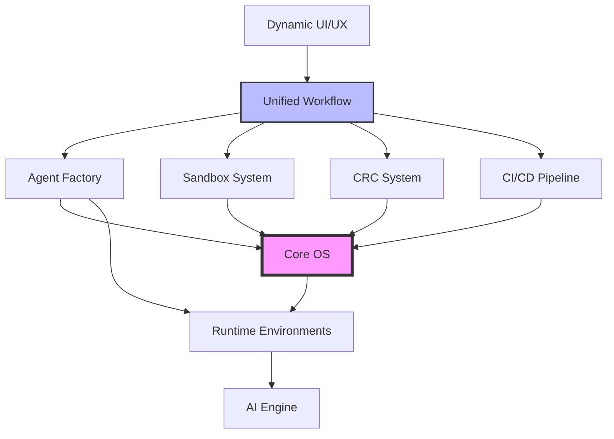
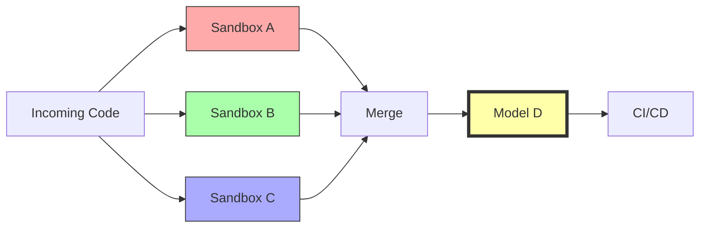
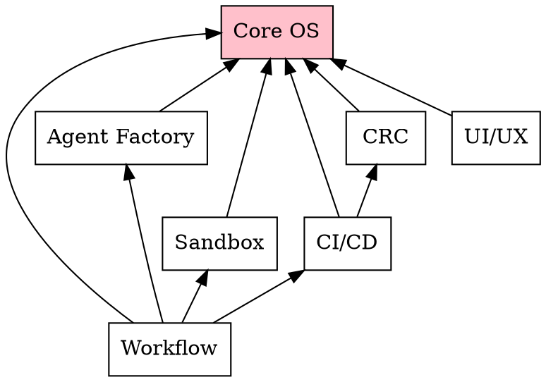
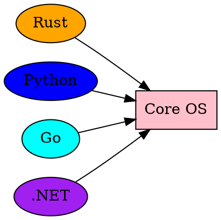
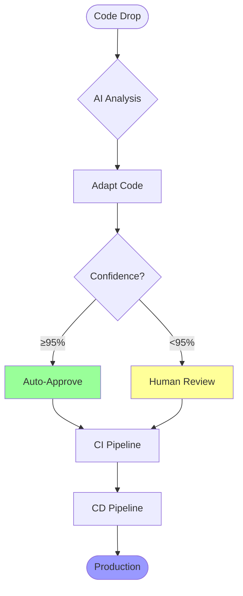
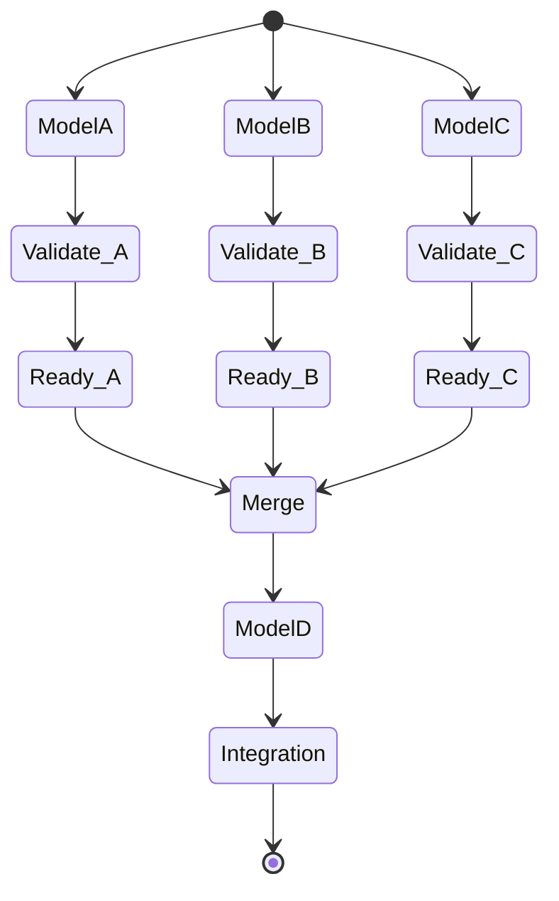
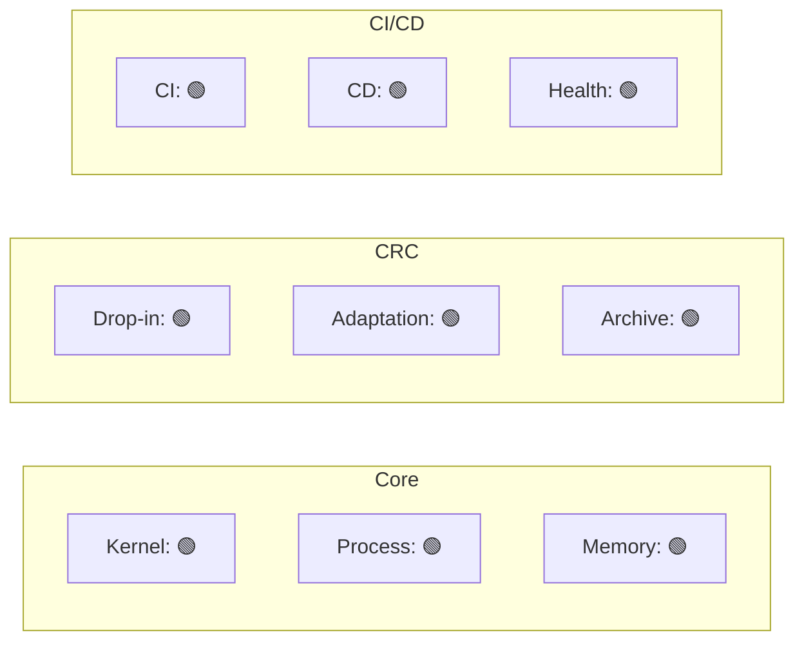

# Graph Generation System

## Overview

NOA ARK OS includes automatic graph generation for architecture, dependencies, workflows, and metrics visualization.

## Graph Types

### 1. Architecture Diagrams
Visual representation of system components and their relationships.

### 2. Dependency Graphs
Show dependencies between components, modules, and external libraries.

### 3. Workflow Visualizations
Flowcharts and state machines for workflows and processes.

### 4. Metrics Dashboards
Real-time dashboards showing system health and performance.

## Directory Structure

```
.graphs/
├── architecture/          # Architecture diagrams
│   ├── system.svg        # Overall system
│   ├── core.svg          # Core OS
│   ├── crc.svg           # CRC system
│   ├── cicd.svg          # CI/CD pipeline
│   └── ...
├── dependencies/          # Dependency graphs
│   ├── workspace.dot     # Workspace dependencies
│   ├── runtime.dot       # Runtime dependencies
│   └── external.dot      # External dependencies
├── workflows/             # Workflow visualizations
│   ├── crc-pipeline.svg  # CRC workflow
│   ├── cicd-flow.svg     # CI/CD flow
│   └── sandbox-merge.svg # Sandbox merge flow
├── metrics/               # Metrics dashboards
│   ├── dashboard.html    # Main dashboard
│   ├── performance.html  # Performance metrics
│   └── health.html       # System health
└── README.md             # This file
```

## Generation

### Automatic Generation

Graphs are automatically generated:
- On workspace initialization
- After significant changes
- On demand via CLI
- During CI/CD pipeline

### Manual Generation

```bash
# Generate all graphs
workspace graphs generate

# Generate specific type
workspace graphs generate --type architecture
workspace graphs generate --type dependencies

# Update existing
workspace graphs update

# Export to format
workspace graphs export --format svg
workspace graphs export --format png
```

## Architecture Diagrams

### System Architecture



### CRC Architecture



## Dependency Graphs

### Component Dependencies



### Runtime Dependencies



## Workflow Visualizations

### CRC/CI/CD Flow



### Sandbox Merge Flow



## Metrics Dashboards

### System Dashboard

```html
<!DOCTYPE html>
<html>
<head>
    <title>NOA ARK OS - System Dashboard</title>
    <script src="https://cdn.plot.ly/plotly-latest.min.js"></script>
</head>
<body>
    <h1>NOA ARK OS System Dashboard</h1>
    
    <div id="cpu-chart" style="width:600px;height:400px;"></div>
    <div id="memory-chart" style="width:600px;height:400px;"></div>
    <div id="requests-chart" style="width:600px;height:400px;"></div>
    
    <script>
        // Real-time updates
        setInterval(updateCharts, 1000);
        
        function updateCharts() {
            // Fetch metrics
            fetch('/api/metrics')
                .then(r => r.json())
                .then(data => {
                    // Update charts
                    updateCPU(data.cpu);
                    updateMemory(data.memory);
                    updateRequests(data.requests);
                });
        }
    </script>
</body>
</html>
```

### Component Health



## Tools

### Graph Generation Tools

```bash
# Install dependencies
sudo apt install graphviz
npm install -g mermaid-cli

# Generate from .dot files
dot -Tsvg dependencies/workspace.dot -o dependencies/workspace.svg

# Generate from .mmd files
mmdc -i workflows/crc-flow.mmd -o workflows/crc-flow.svg

# Generate from code
workspace graphs generate-from-code
```

### Visualization Libraries

- **Graphviz**: DOT language graphs
- **Mermaid**: Markdown-based diagrams
- **D3.js**: Interactive visualizations
- **Plotly**: Real-time charts
- **Cytoscape.js**: Network graphs

## Integration

### With Workspace Management

```rust
// Update graph when files change
on_file_change(|file| {
    if affects_architecture(file) {
        regenerate_architecture_graph();
    }
    if affects_dependencies(file) {
        regenerate_dependency_graph();
    }
});
```

### With CI/CD

```yaml
cicd:
  on_build:
    - generate_dependency_graph
    - update_metrics_dashboard
  
  on_deploy:
    - update_architecture_diagram
    - publish_dashboards
```

### With Documentation

```markdown
# Component Architecture

See the [architecture diagram](.graphs/architecture/component.svg)
for visual representation.
```

## Real-Time Updates

### WebSocket Integration

```javascript
// Connect to metrics WebSocket
const ws = new WebSocket('ws://localhost:8080/metrics');

ws.onmessage = (event) => {
    const metrics = JSON.parse(event.data);
    updateDashboard(metrics);
};
```

### Auto-Refresh

```html
<!-- Auto-refresh every 5 seconds -->
<meta http-equiv="refresh" content="5">
```

## Export Formats

### Supported Formats

- **SVG**: Scalable Vector Graphics (default)
- **PNG**: Raster images
- **PDF**: Portable documents
- **HTML**: Interactive dashboards
- **DOT**: Graphviz source
- **JSON**: Data format

### Export Examples

```bash
# Export to PNG
workspace graphs export --type architecture --format png

# Export to PDF
workspace graphs export --type dependencies --format pdf

# Export dashboard to HTML
workspace graphs export --type metrics --format html
```

## Best Practices

### DO:
✅ Generate graphs automatically
✅ Keep graphs up-to-date
✅ Use consistent styling
✅ Include legends
✅ Add timestamps
✅ Export to version control

### DON'T:
❌ Manually edit generated graphs
❌ Commit large binary images
❌ Use outdated data
❌ Create duplicate graphs
❌ Hardcode metrics

## Examples

### Generate Architecture Diagram

```bash
workspace graphs architecture > .graphs/architecture/system.svg
```

### Update Dependency Graph

```bash
workspace graphs dependencies --update
```

### View Live Dashboard

```bash
workspace graphs dashboard --live
# Opens browser to http://localhost:8080/dashboard
```

## Customization

### Graph Styles

```yaml
# .graphs/config.yaml
styles:
  architecture:
    node_color: "#f9f"
    edge_color: "#333"
    font: "Arial"
  
  dependencies:
    node_shape: "box"
    rankdir: "BT"
  
  metrics:
    theme: "dark"
    refresh_rate: 1000
```

### Templates

Create custom templates in `.graphs/templates/`.

```mermaid
# .graphs/templates/component.mmd
graph TB
    {{#components}}
    {{name}}[{{label}}]
    {{/components}}
    
    {{#edges}}
    {{from}} --> {{to}}
    {{/edges}}
```

## Maintenance

### Update Schedule

- **Real-time**: Metrics dashboards
- **On change**: Architecture, dependencies
- **Hourly**: Workflow visualizations
- **Daily**: Summary reports

### Cleanup

```bash
# Remove old graphs
workspace graphs clean --older-than 30d

# Compress archives
workspace graphs compress
```
