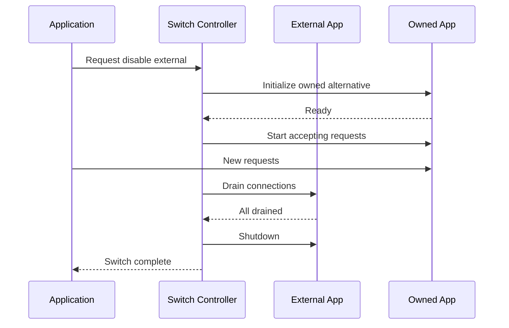
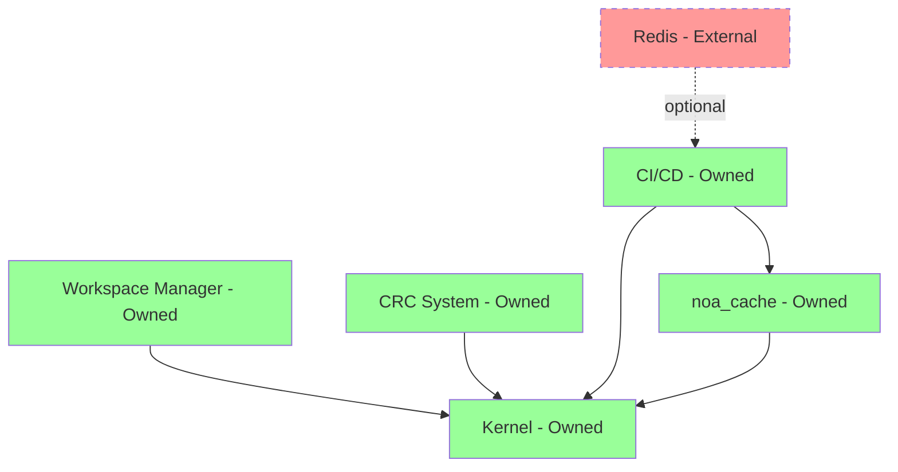

# Self-Hosted Applications System

## Overview

NOA ARK OS prioritizes self-hosting, clearly distinguishing between owned and external applications with the ability to toggle external apps on/off.

## Philosophy

**Self-Host Priority**: All critical functionality must be self-contained. External apps are optional enhancements that can be disabled without breaking core functionality.

## Directory Structure

```
.self-hosted/
├── owned/                 # NOA ARK OS owned applications
│   ├── core/             # Core apps (always on)
│   ├── system/           # System utilities
│   └── bundled/          # Bundled with OS
├── external/              # External applications (can be disabled)
│   ├── enabled/          # Currently enabled
│   └── disabled/         # Currently disabled
├── registry.json          # App registry
├── config.yaml           # Configuration
└── README.md             # This file
```

## App Classification

### Owned Apps (Always Available)

**Core Apps** - Cannot be disabled:
- Kernel
- Process Manager
- Memory Manager
- File System
- Security Manager
- IPC System

**System Utilities** - Core functionality:
- Workspace Manager
- CRC System
- CI/CD Pipeline
- Agent Factory
- Workflow Engine
- Sandbox Manager

**Bundled Apps** - Included but can be configured:
- Terminal/Shell
- File Manager
- Text Editor
- System Monitor
- Log Viewer

### External Apps (Can be Disabled)

**Development Tools**:
- External IDEs
- External debuggers
- Third-party linters

**Optional Services**:
- External databases (if not using embedded)
- External caches
- External message queues

**Integrations**:
- Cloud service integrations
- External APIs
- Third-party plugins

## App Registry

### Registry Structure

**`.self-hosted/registry.json`**:
```json
{
  "version": "1.0",
  "updated": "2024-01-15T10:30:00Z",
  "apps": {
    "core": {
      "kernel": {
        "name": "NOA ARK Kernel",
        "type": "owned",
        "category": "core",
        "status": "always_on",
        "path": "core/src/bin/kernel.rs",
        "version": "1.0.0",
        "can_disable": false,
        "dependencies": []
      },
      "workspace_manager": {
        "name": "Workspace Manager",
        "type": "owned",
        "category": "system",
        "status": "enabled",
        "path": ".workspace/",
        "version": "1.0.0",
        "can_disable": false,
        "dependencies": ["kernel"]
      }
    },
    "external": {
      "redis": {
        "name": "Redis Cache",
        "type": "external",
        "category": "cache",
        "status": "disabled",
        "path": ".self-hosted/external/redis/",
        "version": "7.0.0",
        "can_disable": true,
        "dependencies": [],
        "alternatives": ["noa_cache"]
      },
      "postgresql": {
        "name": "PostgreSQL",
        "type": "external",
        "category": "database",
        "status": "disabled",
        "path": ".self-hosted/external/postgresql/",
        "version": "15.0",
        "can_disable": true,
        "dependencies": [],
        "alternatives": ["noa_storage::db"]
      }
    }
  }
}
```

## Configuration

**`.self-hosted/config.yaml`**:
```yaml
# Self-hosting configuration

priority: "self-hosted-first"

policies:
  # Core functionality must always work
  core_functionality:
    require_owned: true
    allow_external: false
  
  # Optional features can use external
  optional_features:
    prefer_owned: true
    allow_external: true
    require_toggle: true

# External apps
external_apps:
  default_state: "disabled"
  require_explicit_enable: true
  show_alternatives: true

# Owned apps
owned_apps:
  auto_start: true
  health_check: true
  restart_on_fail: true

# Switching
switching:
  hot_swap: true
  zero_downtime: true
  validate_before_switch: true
```

## App Management

### List Apps

```bash
# List all apps
workspace apps list

# List owned apps
workspace apps list --type owned

# List external apps
workspace apps list --type external

# List enabled apps
workspace apps list --status enabled

# Show app details
workspace apps info <app-name>
```

### Enable/Disable External Apps

```bash
# Disable external app
workspace apps disable redis
# → Switches to: noa_cache (owned alternative)

# Enable external app
workspace apps enable redis
# → Switches from: noa_cache to redis

# Check current state
workspace apps status redis
```

### View Alternatives

```bash
# Show alternatives for external app
workspace apps alternatives postgresql

# Output:
# postgresql (external) - DISABLED
# Alternatives:
#   → noa_storage::db (owned) - ACTIVE
#   Features: ACID, embedded, zero-config
```

## Switching Mechanism

### Hot-Swap Process

```rust
// Example: Switch from external Redis to owned cache

// 1. Validate owned alternative exists
if !has_alternative("redis") {
    return Err("No owned alternative available");
}

// 2. Initialize owned alternative
let owned_cache = noa_cache::init()?;

// 3. Migrate data (if needed)
migrate_data(redis, owned_cache)?;

// 4. Switch traffic
switch_to(owned_cache)?;

// 5. Gracefully shutdown external
redis.shutdown_graceful()?;

// 6. Update registry
registry.update_status("redis", "disabled")?;
registry.update_status("noa_cache", "enabled")?;
```

### Zero-Downtime Switching



## Owned Apps Catalog

### Core OS Apps

| App | Category | Status | Can Disable |
|-----|----------|--------|-------------|
| Kernel | Core | Always On | No |
| Process Manager | Core | Always On | No |
| Memory Manager | Core | Always On | No |
| File System | Core | Always On | No |
| IPC | Core | Always On | No |
| Security | Core | Always On | No |

### System Apps

| App | Category | Status | Can Disable |
|-----|----------|--------|-------------|
| Workspace Manager | System | Enabled | No |
| CRC System | System | Enabled | No |
| CI/CD Pipeline | System | Enabled | No |
| Agent Factory | System | Enabled | Yes* |
| Workflow Engine | System | Enabled | Yes* |

*Can disable but breaks automation features

### Bundled Apps

| App | Category | Status | Can Disable |
|-----|----------|--------|-------------|
| Terminal | Utility | Enabled | Yes |
| File Manager | Utility | Enabled | Yes |
| Text Editor | Utility | Enabled | Yes |
| System Monitor | Utility | Enabled | Yes |
| Log Viewer | Utility | Enabled | Yes |

## External Apps (Examples)

### Development

| External App | Owned Alternative | Can Disable |
|--------------|-------------------|-------------|
| VSCode | noa_editor | Yes |
| External Debugger | noa_debug | Yes |
| External Linter | noa_lint | Yes |

### Services

| External App | Owned Alternative | Can Disable |
|--------------|-------------------|-------------|
| Redis | noa_cache | Yes |
| PostgreSQL | noa_storage::db | Yes |
| RabbitMQ | noa_ipc | Yes |
| Nginx | noa_server | Yes |

### Integrations

| External App | Owned Alternative | Can Disable |
|--------------|-------------------|-------------|
| GitHub API | Local Git | Yes |
| AWS S3 | noa_storage::blob | Yes |
| External AI API | noa_ai (local) | Yes |

## Dependency Management

### Dependency Rules

1. **Owned apps** can only depend on other owned apps
2. **External apps** can depend on owned or external apps
3. **Disabling external app** must not break owned apps
4. **Circular dependencies** are not allowed

### Dependency Graph



## Health Monitoring

### Owned Apps

```bash
# Health check owned apps
workspace apps health --type owned

# Output:
# ✓ Kernel: Healthy (uptime: 5d 12h)
# ✓ Workspace Manager: Healthy (uptime: 5d 12h)
# ✓ CRC System: Healthy (last run: 2h ago)
# ✓ CI/CD: Healthy (last deploy: 30m ago)
```

### External Apps

```bash
# Health check external apps
workspace apps health --type external

# Output:
# ⚠ Redis: Disabled (alternative: noa_cache - Active)
# ⚠ PostgreSQL: Disabled (alternative: noa_storage::db - Active)
```

## Auto-Fallback

### Fallback Strategy

If external app fails:
1. Detect failure
2. Check for owned alternative
3. Switch to owned alternative automatically
4. Log incident
5. Alert admin (if configured)
6. Mark external app as "failed"

```yaml
auto_fallback:
  enabled: true
  detection:
    health_check_interval: 30s
    failure_threshold: 3
  
  action:
    switch_to_owned: true
    notify_admin: true
    log_incident: true
```

## Migration Tools

### Import External App

```bash
# Import external app configuration
workspace apps import --source redis --config redis.conf

# Review alternatives
workspace apps alternatives redis

# Keep using external
workspace apps enable redis

# Or switch to owned
workspace apps disable redis
```

### Export Configuration

```bash
# Export app configuration
workspace apps export redis > redis-config.json

# Export registry
workspace apps export-registry > app-registry.json
```

## Best Practices

### DO:
✅ Prefer owned apps for core functionality
✅ Use external apps for optional features
✅ Always have owned alternative
✅ Test failover regularly
✅ Monitor external app health
✅ Document dependencies

### DON'T:
❌ Depend on external for core features
❌ Skip owned alternatives
❌ Ignore health checks
❌ Create circular dependencies
❌ Hardcode external app paths

## Security

### Owned Apps
- Trusted code
- Full access to system
- No network restrictions
- Direct IPC

### External Apps
- Sandboxed execution
- Limited permissions
- Network restrictions
- Mediated IPC

## Performance

### Owned Apps
- Zero network latency
- Direct memory access
- Optimized for platform
- Always fastest

### External Apps
- Network latency possible
- IPC overhead
- Generic implementation
- May be slower

## Licensing

### Owned Apps
- MIT License (NOA ARK OS)
- No licensing restrictions
- Full source available

### External Apps
- Various licenses
- License compliance required
- May have usage restrictions

## Future

- [ ] Auto-discovery of external apps
- [ ] Marketplace for owned alternatives
- [ ] Performance comparison dashboard
- [ ] Cost analysis (owned vs external)
- [ ] Automated migration tools
