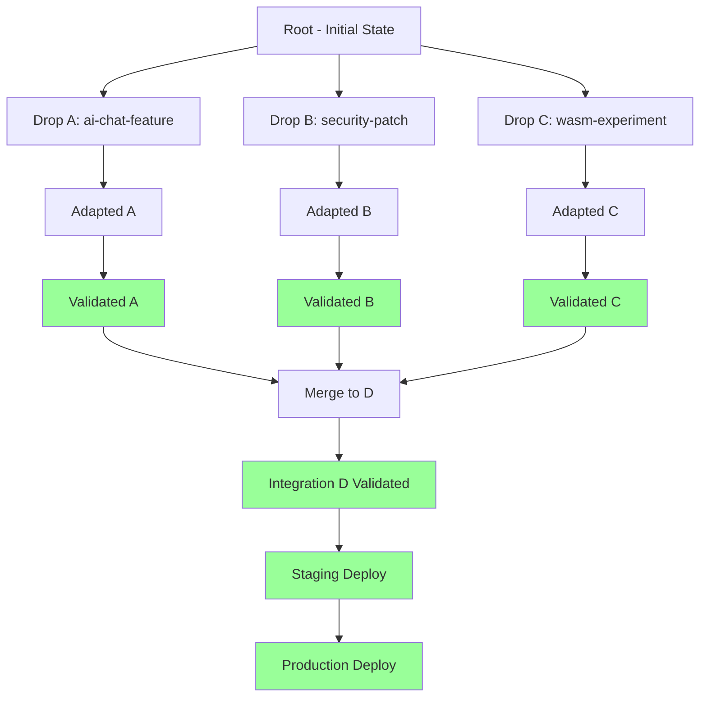

# CL Tree (Change Log Tree) Integration

## Overview

The CL (Change Log) Tree provides comprehensive version tracking and change history for all code drops processed through the CRC/CI/CD pipeline.

## Architecture

```
CL Tree Structure:
├── Root (Initial State)
│   ├── Branch: Feature A
│   │   ├── Commit: ai-chat-feature-v1
│   │   ├── Commit: ai-chat-feature-v2
│   │   └── Merge: → Integration D
│   ├── Branch: Bug Fix B
│   │   ├── Commit: security-patch-cve-2024
│   │   └── Merge: → Integration D
│   └── Branch: Experimental C
│       ├── Commit: wasm-runtime-experiment
│       └── Merge: → Integration D (optional)
```

## Integration with CRC/CI/CD

### 1. Drop Registration

When code is dropped, a CL Tree entry is created:

```rust
// crc/src/cl_tree.rs
use std::collections::HashMap;
use serde::{Deserialize, Serialize};

#[derive(Debug, Clone, Serialize, Deserialize)]
pub struct CLNode {
    pub id: String,
    pub parent: Option<String>,
    pub drop_id: String,
    pub sandbox_model: String,
    pub timestamp: u64,
    pub changes: Vec<Change>,
    pub status: CLStatus,
    pub metadata: HashMap<String, String>,
}

#[derive(Debug, Clone, Serialize, Deserialize)]
pub struct Change {
    pub file_path: String,
    pub change_type: ChangeType,
    pub lines_added: usize,
    pub lines_removed: usize,
    pub diff: String,
}

#[derive(Debug, Clone, Serialize, Deserialize, PartialEq)]
pub enum ChangeType {
    Added,
    Modified,
    Deleted,
    Renamed,
}

#[derive(Debug, Clone, Serialize, Deserialize, PartialEq)]
pub enum CLStatus {
    Pending,
    Adapted,
    Validated,
    Merged,
    Deployed,
    Failed,
}

pub struct CLTree {
    nodes: HashMap<String, CLNode>,
    root: String,
}

impl CLTree {
    pub fn new() -> Self {
        let root_id = "root".to_string();
        let mut nodes = HashMap::new();
        
        nodes.insert(root_id.clone(), CLNode {
            id: root_id.clone(),
            parent: None,
            drop_id: "initial".to_string(),
            sandbox_model: "main".to_string(),
            timestamp: 0,
            changes: vec![],
            status: CLStatus::Deployed,
            metadata: HashMap::new(),
        });
        
        Self { nodes, root: root_id }
    }
    
    pub fn add_node(
        &mut self,
        parent_id: &str,
        drop_id: String,
        sandbox_model: String,
        changes: Vec<Change>,
    ) -> Result<String, String> {
        let node_id = format!("cl_{}", uuid::Uuid::new_v4());
        
        let node = CLNode {
            id: node_id.clone(),
            parent: Some(parent_id.to_string()),
            drop_id,
            sandbox_model,
            timestamp: std::time::SystemTime::now()
                .duration_since(std::time::UNIX_EPOCH)
                .unwrap()
                .as_secs(),
            changes,
            status: CLStatus::Pending,
            metadata: HashMap::new(),
        };
        
        self.nodes.insert(node_id.clone(), node);
        Ok(node_id)
    }
    
    pub fn update_status(&mut self, node_id: &str, status: CLStatus) -> Result<(), String> {
        if let Some(node) = self.nodes.get_mut(node_id) {
            node.status = status;
            Ok(())
        } else {
            Err(format!("Node not found: {}", node_id))
        }
    }
    
    pub fn get_path_to_root(&self, node_id: &str) -> Vec<String> {
        let mut path = vec![];
        let mut current_id = node_id.to_string();
        
        while let Some(node) = self.nodes.get(&current_id) {
            path.push(current_id.clone());
            if let Some(parent) = &node.parent {
                current_id = parent.clone();
            } else {
                break;
            }
        }
        
        path.reverse();
        path
    }
    
    pub fn export_tree(&self) -> String {
        self.export_node(&self.root, 0)
    }
    
    fn export_node(&self, node_id: &str, depth: usize) -> String {
        let mut result = String::new();
        let indent = "  ".repeat(depth);
        
        if let Some(node) = self.nodes.get(node_id) {
            result.push_str(&format!(
                "{}├── {} ({:?}) - {}\n",
                indent, node.drop_id, node.status, node.sandbox_model
            ));
            
            // Find children
            for (child_id, child_node) in &self.nodes {
                if let Some(parent) = &child_node.parent {
                    if parent == node_id {
                        result.push_str(&self.export_node(child_id, depth + 1));
                    }
                }
            }
        }
        
        result
    }
}
```

### 2. CRC Integration

```rust
// Update CRC system to use CL Tree
impl CRCSystem {
    pub fn new_with_cl_tree(config: CRCConfig) -> Self {
        let cl_tree = CLTree::new();
        // ... initialization
    }
    
    pub fn register_drop_with_cl(
        &mut self,
        path: PathBuf,
        manifest: DropManifest,
    ) -> Result<(String, String), String> {
        let drop_id = self.register_drop(path.clone(), manifest.clone())?;
        
        // Extract changes
        let changes = self.analyze_changes(&path)?;
        
        // Add to CL Tree
        let cl_node_id = self.cl_tree.add_node(
            "root",
            drop_id.clone(),
            "incoming".to_string(),
            changes,
        )?;
        
        Ok((drop_id, cl_node_id))
    }
    
    pub fn update_cl_status(&mut self, drop_id: &str, status: CLStatus) -> Result<(), String> {
        // Find CL node for drop
        // Update status
        self.cl_tree.update_status(node_id, status)
    }
}
```

### 3. CI/CD Integration

```yaml
# cicd/config/cl_tree.yaml
cl_tree:
  enabled: true
  storage: ".workspace/cl_tree/"
  retention_days: 365
  
  hooks:
    on_drop:
      - create_cl_node
      - analyze_changes
      - update_status_pending
    
    on_adapt:
      - update_status_adapted
      - record_adaptations
    
    on_validate:
      - update_status_validated
      - record_test_results
    
    on_merge:
      - update_status_merged
      - create_merge_node
    
    on_deploy:
      - update_status_deployed
      - tag_release
    
    on_fail:
      - update_status_failed
      - record_error
  
  visualization:
    format: "mermaid"
    output: ".graphs/cl_tree/"
    auto_generate: true
```

## CL Tree Visualization

### Mermaid Diagram



## CLI Commands

```bash
# View CL Tree
crc cl tree

# View specific branch
crc cl tree --branch model-a

# Export to file
crc cl tree --export cl_tree.json

# View history for drop
crc cl history <drop-id>

# Compare two nodes
crc cl diff <node-id-1> <node-id-2>

# Show changes in node
crc cl changes <node-id>
```

## Storage Format

**`.workspace/cl_tree/tree.json`**:
```json
{
  "root": "root",
  "nodes": {
    "root": {
      "id": "root",
      "parent": null,
      "drop_id": "initial",
      "sandbox_model": "main",
      "timestamp": 0,
      "changes": [],
      "status": "Deployed",
      "metadata": {}
    },
    "cl_abc-123": {
      "id": "cl_abc-123",
      "parent": "root",
      "drop_id": "drop_xyz",
      "sandbox_model": "model-a",
      "timestamp": 1705320000,
      "changes": [
        {
          "file_path": "src/chat.rs",
          "change_type": "Added",
          "lines_added": 150,
          "lines_removed": 0,
          "diff": "..."
        }
      ],
      "status": "Deployed",
      "metadata": {
        "ai_confidence": "96",
        "deployed_version": "v2.0.0"
      }
    }
  }
}
```

## Integration with Graphs

CL Tree graphs are automatically generated in `.graphs/cl_tree/`:
- `current.svg` - Current state
- `history.svg` - Full history
- `branch-<model>.svg` - Per-sandbox branch

## Backup and Recovery

```yaml
backup:
  cl_tree:
    enabled: true
    schedule: "0 2 * * *"  # Daily at 2 AM
    compression: "zstd"
    retention: 365  # days
    location: ".workspace/backups/cl_tree/"
```

## Audit Trail

Every CL Tree change is logged:
```
[2024-01-15 10:30:00] CL Node Created: cl_abc-123
  Drop: drop_xyz
  Sandbox: model-a
  Status: Pending

[2024-01-15 10:32:15] CL Status Updated: cl_abc-123
  Old: Pending
  New: Adapted
  AI Confidence: 96%

[2024-01-15 10:45:30] CL Status Updated: cl_abc-123
  Old: Adapted
  New: Deployed
  Version: v2.0.0
```

## Benefits

1. **Complete History**: Every change tracked from drop to production
2. **Traceability**: Follow any change back to its source
3. **Audit Trail**: Full compliance and debugging support
4. **Rollback Support**: Easy identification of what to roll back
5. **Visualization**: Clear view of all changes and their paths
6. **Integration**: Seamless with CRC/CI/CD pipeline
