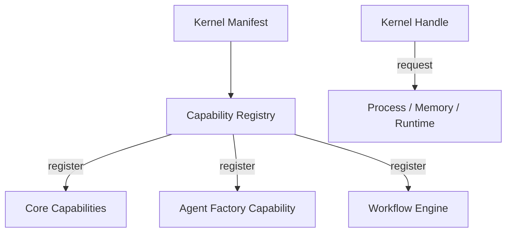

# Kernel-First Capability Architecture

The NOA ARK OS kernel now manages all critical services through a capability
registry. Higher-level modules interact with services by requesting
capabilities from the kernel handle rather than importing subsystems directly.

## Capability Lifecycle

1. The kernel loads a manifest describing core capabilities and runtime
   dependencies (`core/config/default_manifest.yaml`).
2. `noa_core::capabilities::CapabilityRegistry` registers built-in providers for
   process, memory, IPC, file-system, security, gateway, and runtime management.
3. Higher-level crates (agents, workflow, UI) register their own capabilities on
   top of the kernel and obtain handles via `KernelHandle::request`.
4. Shutdown executes in reverse order using capability shutdown hooks to ensure
   deterministic teardown.

## Dependency Rules

- Capabilities declare explicit dependencies. The registry performs
  topological sorting before initialization and detects cycles.
- High-level modules use published capability identifiers:
  - `core.process`, `core.memory`, `core.runtime.manager`
  - `agents.factory`
- Kernel manifests must list the capabilities required for bootstrapping. Extra
  capabilities can be registered at runtime using `KernelHandle::registry()`.

## Portable Packaging

The portable builder (`tools/portable_builder.py`) consumes the kernel manifest
and produces reproducible bundles. Each bundle contains:

- A capability manifest snapshot (`bundle.json`)
- Runtime descriptors under `runtimes/<name>/runtime.json`
- Target-specific descriptors (OCI, WASI, etc.) under `targets/<format>`
- A deterministic lock hash (`bundle.lock`) for CI verification

CI recipes can invoke `python tools/portable_builder.py --output build/portable`
and then hash the resulting directory to ensure reproducibility.
