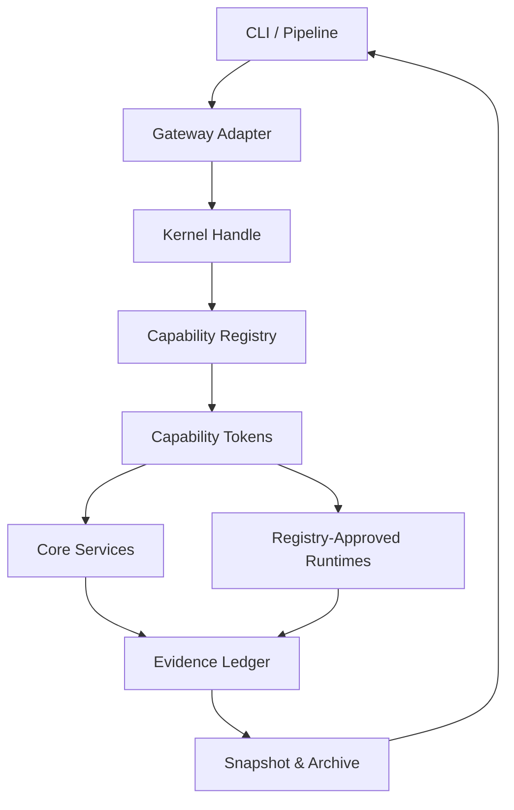
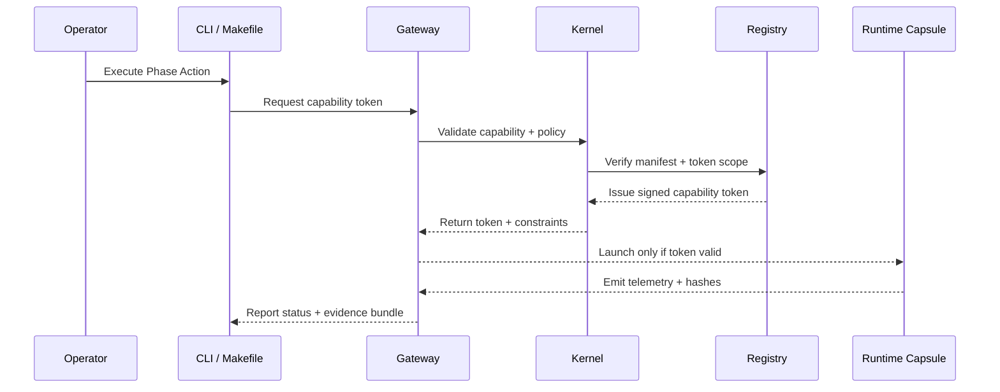

# Agentic OS Operator Guide

This guide connects the repository's agent policy, roadmap phases, and day-to-day
operator practices. It distills the mandatory rules from
[`AGENT.md`](../../AGENT.md) into repeatable workflows, highlights the
Phase 0.5–10 progression, and demonstrates how kernel sovereignty and gateway
capability tokens keep the system safe-by-default.

## Operator Workflow Overview

The operator loop is anchored in the **4-D method** defined in `AGENT.md`:
Deconstruct → Diagnose → Develop → Deliver. Each cycle must:

1. Start from a verifiable intent recorded in the Evidence Ledger.
2. Run the plan through the Truth Gate checklist with explicit verification steps.
3. Promote artifacts only after kernel-backed capability tokens confirm registry
   compliance.
4. Archive or snapshot before replacing any asset so history remains reversible.

Operators should always work through CLI-first surfaces (see
[`Makefile`](../../Makefile) targets) and capture evidence as part of the
workflow. Online activity is guarded behind explicit feature flags per policy.

## Phase 0.5–10 Execution Patterns

The roadmap (`docs/tasks/ROADMAP_AGENTIC_KERNEL_TASK_LINKS.md`) defines the
sequence the operator must respect. Key patterns to keep active are:

### Phase 0.5 — CLI-First Foundation

- Route all orchestration through `pnpm` + `cargo` entry points exposed in the
  Makefile (`pipeline.local`, `kernel`, `snapshot`).
- Maintain workspace parity by relying on gateway-managed manifests (no
  ad-hoc dependency installs).

### Phase 1 — Kernel-First Baseline

- Ensure the kernel manifest and capability registry stay authoritative.
- Capture snapshots (`make snapshot`) before executing structural migrations.

### Phase 2 — North Star Implementation & Phase 3 — Contract Tests

- Extend capabilities through the registry rather than direct imports.
- Use Triple-Verification (policy Section 7) to validate new automation.

### Phase 4 — CLI Expansion & Registry Completion

- Prefer CLI flows that emit machine-readable artifacts (JSON manifests,
  markdown ledgers) so automation can replay decisions.

### Phase 5 — Gateway Slimming & Capability Tokens

- Bind every external integration to tokenized capability handles exposed by
  the kernel and routed through `services/gateway/`.
- Registry-only execution: manifests in `.workspace/registry/` define allowed
  runtimes; operators may not execute binaries outside these definitions.

### Phase 6 — Retrieval Discipline & Phase 7 — Reward System

- Update metrics (`metrics/`, `storage/analytics/`) to reflect integrity and
  reward computations. Contracts must remain reproducible with kernel handles.

### Phase 8 — SBOM Split & Phase 9 — Deployment Profiles

- Generate SBOM placeholders via the Makefile until the Phase 8 implementation
  lands; record every artifact hash in the Evidence Ledger.
- Promote deployment profiles only through the orchestrated gateway pipeline.

### Phase 10 — Machine-First Pipelines

- Keep CI entries (`cicd/`) aligned with local CLI commands to ensure parity.
- Document machine-first behaviors inside the Truth Gate checklist before
  closing a task.

## Policy Enforcement in Practice

Policy sections that must be enforced at every stage:

- **Heal, Do Not Harm:** Upgrade-only changes. Archive anything replaced under
  `archive/YYYY/MM/` and record the ledger entry.
- **Anti-Rot:** Every touch should tighten tests, documentation, or automation.
- **Gateway Sovereignty:** Dependencies, secrets, and runtimes flow through
  gateway shims (`server/gateway/`, `services/gateway/`, `.workspace/registry/`).
- **Offline-First:** Run offline by default; document and flag online work.
- **Completion Gate:** Never close without the Truth Gate checklist, evidence
  ledger, and duplicate-check plan recorded.

## CLI-First Practices

- Use `make ci:local` to run the lint, typecheck, format, test, and documentation
  checks before committing.
- `make snapshot` prepares reversible archives; pair with Evidence Ledger notes.
- `pnpm offline:queue` routes work through the offline PR queue to preserve
  determinism.
- PowerShell equivalents should be documented alongside shell scripts when
  authoring cross-platform workflows.

## Architecture Reference

The following diagrams are stored in `.graphs/workflows/` and embedded here for
quick reference.

### Kernel Sovereignty Control Loop

### Tokenized Gateway Flow

## Evidence & Reporting Checklist

1. Update `evidence.ledger.json` with artifact hashes and kernel token IDs.
2. Attach `claims.table.md` and `truth_gate.checklist.md` to the task workspace.
3. Record doc changes, diagrams, and CLI outputs in the Change Log entry.
4. If a guide or policy is updated, cross-link it inside `AGENT.md` and roadmap
   references to maintain a single source of truth.

## Further Reading

- [`AGENT.md`](../../AGENT.md) – authoritative policy, Phase alignment, and
  completion gate.
- [`docs/tasks/ROADMAP_AGENTIC_KERNEL_TASK_LINKS.md`](../tasks/ROADMAP_AGENTIC_KERNEL_TASK_LINKS.md)
  – detailed per-phase contracts.
- [`docs/architecture/kernel-first.md`](../architecture/kernel-first.md) –
  kernel capability registry background.
- [`docs/guides/WORKSPACE_MEMORY_PIPELINE.md`](WORKSPACE_MEMORY_PIPELINE.md) –
  evidence ledger and memory pipeline walkthrough.
