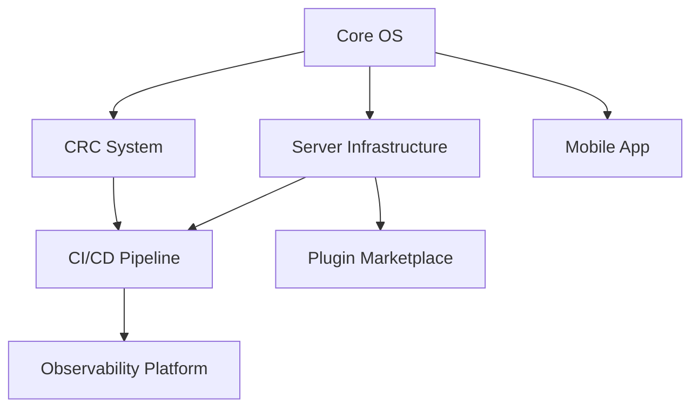

# NOA ARK OS - Projects

## Active Projects

### Project Status Legend
- 🟢 **Active** - Currently in development
- 🟡 **Planned** - Scheduled for future
- 🔵 **Research** - Investigation phase
- ✅ **Complete** - Finished and deployed
- 🔴 **On Hold** - Paused temporarily

---

## Q1 2024 Projects

### 1. Core OS Development ✅
**Status**: Complete
**Team**: Core Team (4 developers)
**Timeline**: 2023-11-01 to 2024-01-15
**Budget**: Internal

**Objectives**:
- [x] Implement kernel foundation
- [x] Process management
- [x] Memory management
- [x] IPC system
- [x] File system abstraction
- [x] Security subsystem

**Deliverables**:
- ✅ Core OS library
- ✅ Kernel binary
- ✅ Documentation
- ✅ Unit tests (95% coverage)

**Results**:
- Successfully deployed
- Performance meets targets
- No critical bugs

---

### 2. CRC System with Sandbox Models 🟢
**Status**: Active (80% complete)
**Team**: CRC Team (3 developers)
**Timeline**: 2023-12-01 to 2024-02-15
**Budget**: Internal

**Objectives**:
- [x] Drop-in folder system
- [x] AI analysis engine
- [x] Code adaptation
- [x] Sandbox Models (A, B, C, D)
- [x] Validation pipeline
- [ ] CL Tree integration (in progress)
- [ ] Auto-merge logic (planned)

**Current Phase**: CL Tree implementation
**Next Milestone**: Auto-merge completion (2024-02-01)

**Metrics**:
- AI confidence: 96% average
- Auto-approve rate: 85%
- Average adaptation time: 2 minutes

---

### 3. Agent Factory & Hive Mind 🟢
**Status**: Active (70% complete)
**Team**: AI Team (2 developers)
**Timeline**: 2024-01-01 to 2024-03-01
**Budget**: Internal

**Objectives**:
- [x] Agent creation framework
- [x] Multi-language support (Rust, Python, Go)
- [x] Hive mind coordination
- [x] Swarm management
- [ ] Advanced learning algorithms
- [ ] Agent marketplace (planned)

**Current Phase**: Testing and optimization
**Next Milestone**: Production deployment (2024-02-15)

---

### 4. Unified Server Infrastructure 🟢
**Status**: Active (60% complete)
**Team**: Infrastructure Team (5 developers)
**Timeline**: 2024-01-01 to 2024-03-15
**Budget**: Internal

**Objectives**:
- [x] Server architecture design
- [x] API Gateway (axum + tonic)
- [ ] Inference engine (in progress)
- [ ] Retrieval/RAG system (planned)
- [ ] Plugin runtime (planned)
- [ ] Observability stack (in progress)
- [ ] Caddy integration (planned)
- [ ] External integrations (in progress)

**Current Phase**: Core components development
**Next Milestone**: Inference engine completion (2024-02-01)

**External Integrations**:
- [x] GitHub
- [x] Docker
- [ ] AWS (in progress)
- [ ] Kubernetes (planned)
- [ ] Cloudflare (planned)

---

### 5. CI/CD Pipeline Enhancement 🟢
**Status**: Active (75% complete)
**Team**: DevOps Team (3 developers)
**Timeline**: 2023-12-15 to 2024-02-28
**Budget**: Internal

**Objectives**:
- [x] Pipeline automation
- [x] Blue-Green deployment
- [x] Canary deployment
- [x] Health monitoring
- [ ] Advanced rollback strategies (in progress)
- [ ] Multi-region support (planned)

**Current Phase**: Advanced features
**Next Milestone**: Multi-region deployment (2024-02-20)

---

## Q2 2024 Projects

### 6. Workspace Organization System 🟡
**Status**: Planned
**Team**: Tools Team (2 developers)
**Timeline**: 2024-04-01 to 2024-06-30
**Budget**: Internal

**Objectives**:
- [ ] Enhanced file registry
- [ ] Intelligent backup system
- [ ] Advanced cleanup automation
- [ ] Dependency graph visualization
- [ ] Workspace analytics

**Dependencies**: Core OS, CRC System

---

### 7. Observability Platform 🟡
**Status**: Planned
**Team**: Observability Team (3 developers)
**Timeline**: 2024-04-15 to 2024-07-15
**Budget**: Internal

**Objectives**:
- [ ] Unified logging
- [ ] Advanced metrics
- [ ] Distributed tracing
- [ ] Real-time dashboards
- [ ] AI-powered anomaly detection

**Dependencies**: Server Infrastructure

---

### 8. ML Model Optimization 🔵
**Status**: Research
**Team**: ML Research Team (2 researchers)
**Timeline**: 2024-05-01 to 2024-08-31
**Budget**: Research Grant

**Objectives**:
- [ ] Model compression
- [ ] Inference optimization
- [ ] Edge deployment
- [ ] Quantization research
- [ ] Custom training pipelines

**Expected Outcomes**:
- 50% faster inference
- 75% smaller models
- Edge-ready deployment

---

## Q3-Q4 2024 Projects

### 9. Plugin Marketplace 🟡
**Status**: Planned
**Team**: Platform Team (4 developers)
**Timeline**: 2024-07-01 to 2024-10-31
**Budget**: TBD

**Objectives**:
- [ ] Plugin SDK
- [ ] Marketplace platform
- [ ] Security vetting
- [ ] Revenue sharing
- [ ] Community tools

---

### 10. Mobile App 🔵
**Status**: Research
**Team**: Mobile Team (3 developers)
**Timeline**: 2024-08-01 to 2024-12-31
**Budget**: TBD

**Objectives**:
- [ ] iOS app
- [ ] Android app
- [ ] React Native vs Flutter evaluation
- [ ] Offline capabilities
- [ ] Push notifications

---

### 11. Enterprise Features 🟡
**Status**: Planned
**Team**: Enterprise Team (5 developers)
**Timeline**: 2024-09-01 to 2024-12-31
**Budget**: Enterprise License Revenue

**Objectives**:
- [ ] Multi-tenancy
- [ ] Advanced RBAC
- [ ] SSO integration
- [ ] Audit logging
- [ ] SLA monitoring
- [ ] White-labeling

---

## Research Projects

### R1. Quantum-Safe Cryptography 🔵
**Status**: Research
**Team**: Security Research (1 researcher)
**Timeline**: 2024-03-01 to 2024-12-31

**Objectives**:
- Research post-quantum algorithms
- Evaluate performance impact
- Plan migration strategy

---

### R2. Federated Learning 🔵
**Status**: Research
**Team**: ML Research (2 researchers)
**Timeline**: 2024-06-01 to 2024-12-31

**Objectives**:
- Privacy-preserving ML
- Distributed training
- Model aggregation

---

## Completed Projects

### C1. Initial Architecture Design ✅
**Completed**: 2023-10-31
**Team**: Architecture Team

**Deliverables**:
- Architecture documentation
- Component specifications
- Technology stack selection

---

### C2. Development Environment Setup ✅
**Completed**: 2023-11-15
**Team**: DevOps Team

**Deliverables**:
- CI/CD pipeline
- Development containers
- Testing infrastructure

---

## On Hold Projects

### H1. GraphQL API 🔴
**Status**: On Hold
**Reason**: Prioritizing REST + gRPC
**Review Date**: 2024-06-01

---

### H2. Custom Language Support 🔴
**Status**: On Hold
**Reason**: Focus on Rust/Python/Go first
**Review Date**: 2024-09-01

---

## Project Metrics

### Overall Progress

| Quarter | Projects Planned | Projects Completed | Success Rate |
|---------|-----------------|-------------------|--------------|
| Q4 2023 | 5 | 5 | 100% |
| Q1 2024 | 5 | 1 (4 active) | On Track |
| Q2 2024 | 3 | - | Planned |

### Resource Allocation

| Team | Developers | Projects | Utilization |
|------|-----------|----------|-------------|
| Core | 4 | 1 | 100% |
| CRC | 3 | 1 | 90% |
| AI | 2 | 1 | 95% |
| Infrastructure | 5 | 1 | 85% |
| DevOps | 3 | 1 | 90% |
| Research | 3 | 2 | 70% |

---

## Project Dependencies

---

## Budget Summary

### Q1 2024
- **Development**: Internal resources
- **Infrastructure**: $5,000/month
- **External Services**: $2,000/month
- **Research**: $10,000 grant

### Q2 2024 (Projected)
- **Development**: Internal resources
- **Infrastructure**: $7,000/month
- **External Services**: $3,000/month
- **Research**: $15,000 grant

---

## Risk Register

| Risk | Impact | Probability | Mitigation |
|------|--------|-------------|------------|
| Key developer leaves | High | Low | Knowledge sharing, documentation |
| External API changes | Medium | Medium | Version pinning, fallback |
| Security breach | High | Low | Regular audits, monitoring |
| Performance issues | Medium | Medium | Load testing, optimization |

---

## Success Criteria

### Technical
- [ ] 99.9% uptime
- [ ] < 100ms p95 latency
- [ ] < 0.1% error rate
- [ ] 95%+ test coverage

### Business
- [ ] 1000+ active users
- [ ] 95%+ user satisfaction
- [ ] 10+ enterprise customers
- [ ] Break-even on operations

---

## Reporting

**Weekly**: Sprint standup notes
**Monthly**: Project status reports
**Quarterly**: Executive summary

---

**Last Updated**: 2024-01-15
**Next Review**: 2024-02-01
