# NOA ARK OS - Workspace Flow Diagram

## Complete System Flow

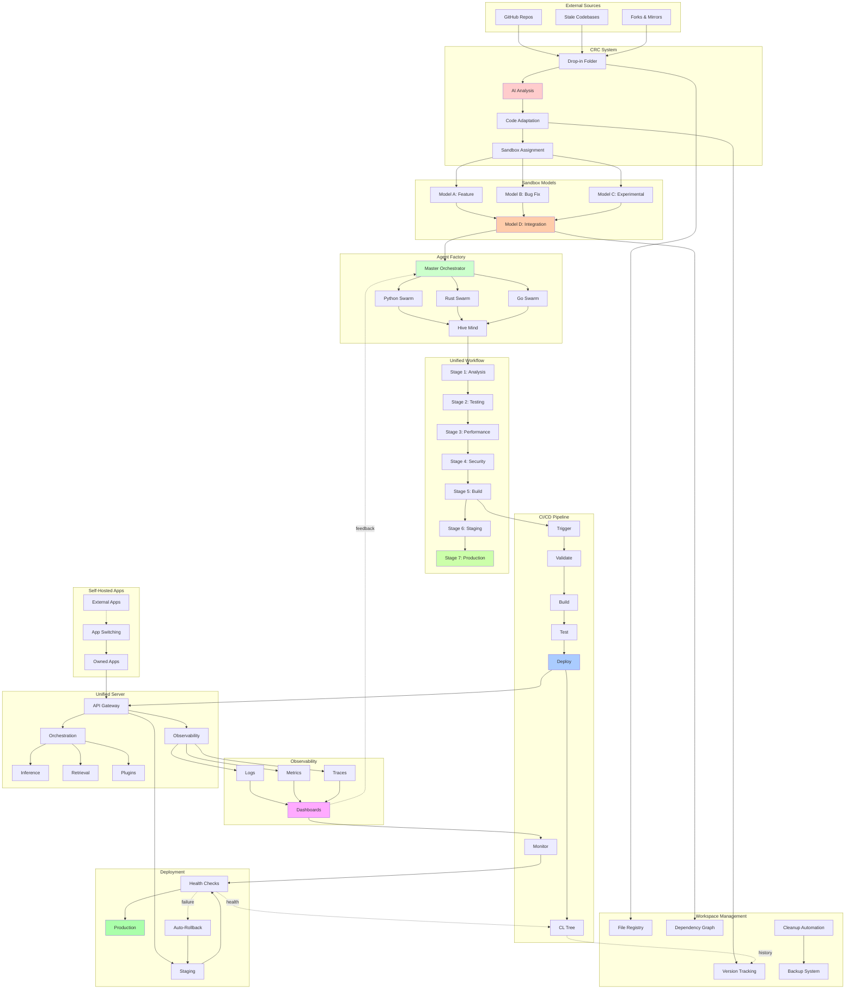

## Detailed Component Flows

### 1. Code Drop Flow

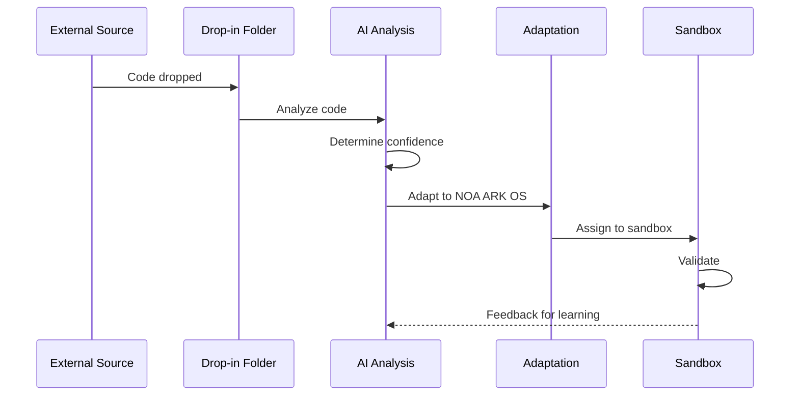

### 2. Sandbox Merge Flow

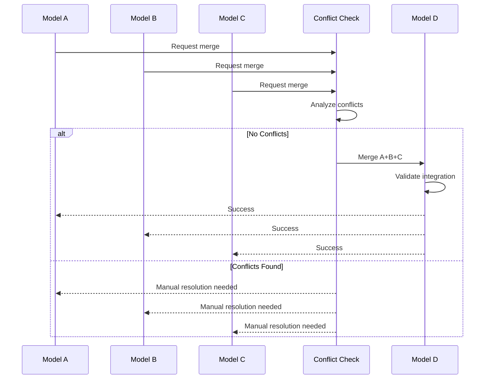

### 3. Agent Swarm Execution

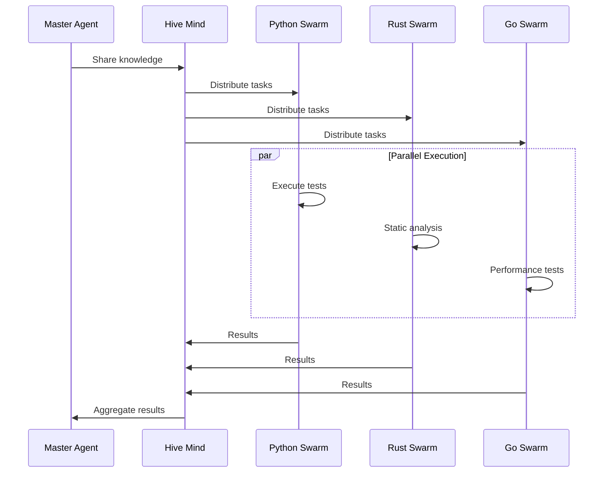

### 4. CI/CD Deployment Flow

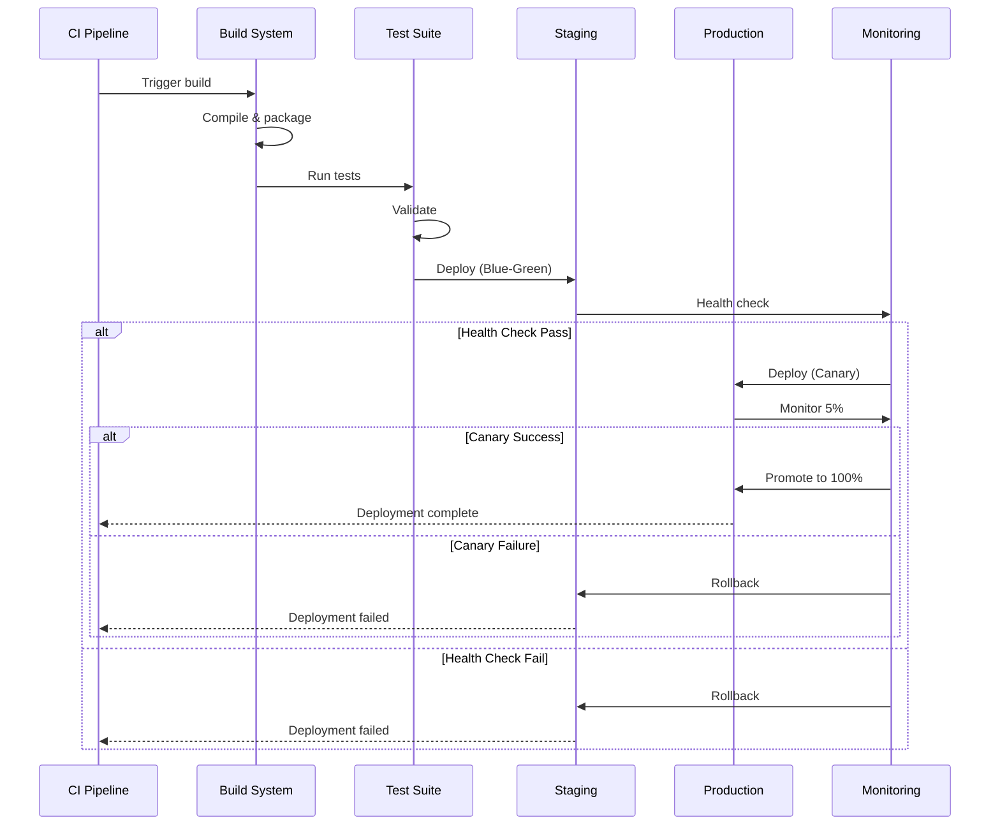

### 5. Workspace Management Flow

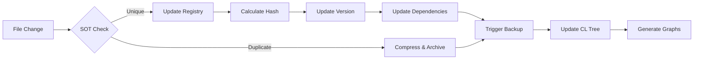

### 6. Self-Hosted App Switching

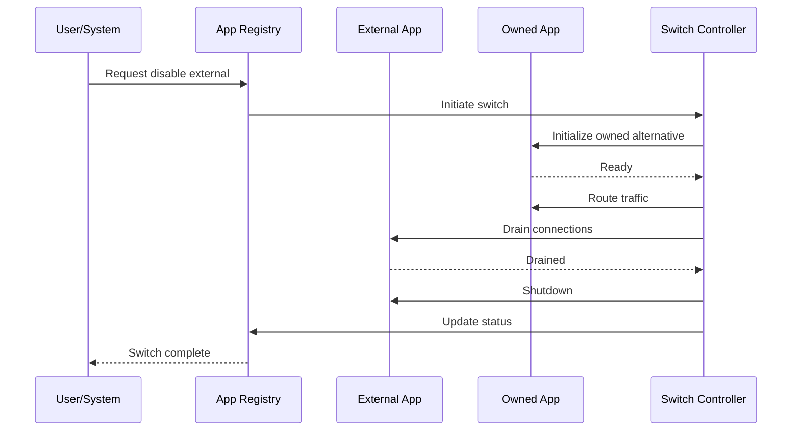

## Data Flow Patterns

### Read Flow

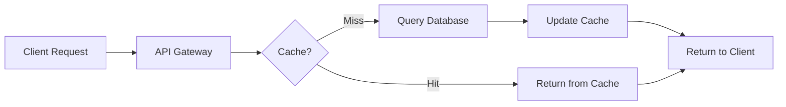

### Write Flow

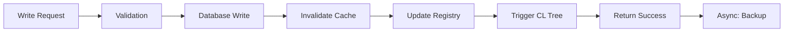

### Event Flow

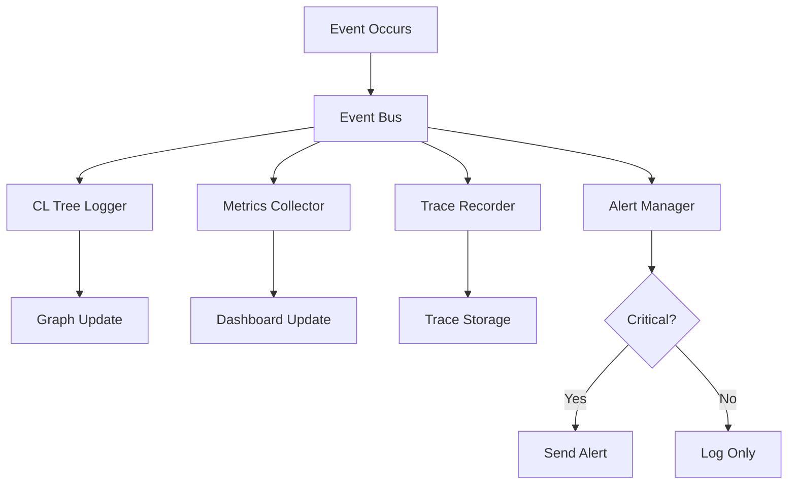

## Integration Points

### External Integrations

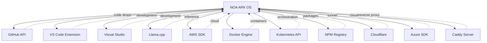

## Performance Flow

### Request Processing

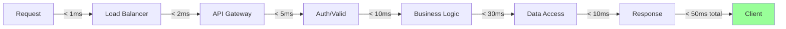

### Batch Processing

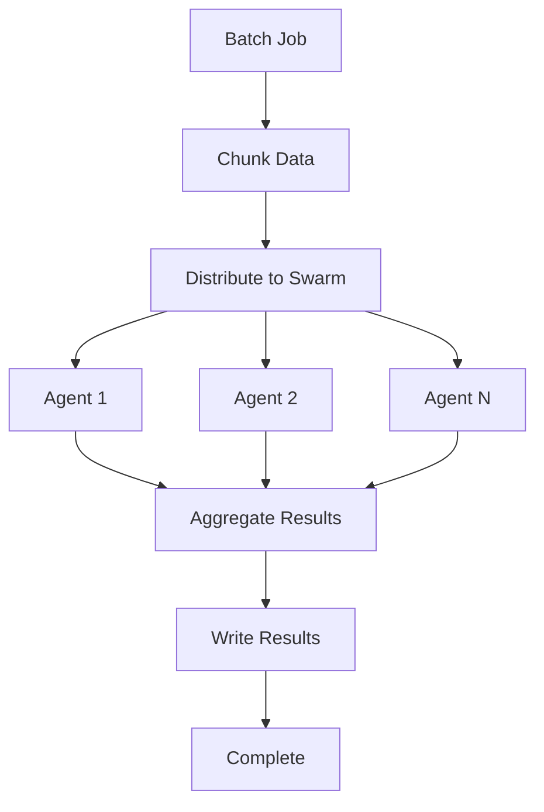

## Error Handling Flow

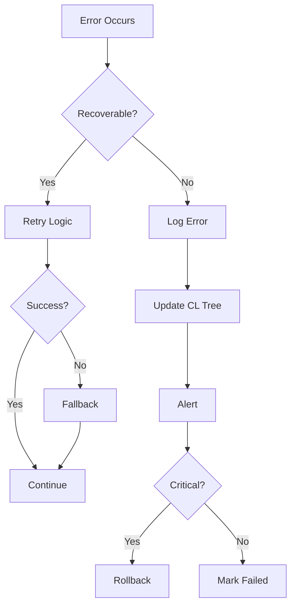

## Usage

View these diagrams by:
1. Opening this file in GitHub/GitLab (auto-renders Mermaid)
2. Using Mermaid Live Editor (https://mermaid.live)
3. VS Code with Mermaid extension
4. Generate PNGs: `mmdc -i WORKSPACE_FLOW.md -o flow.png`
