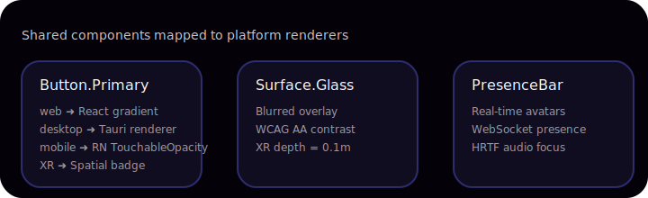

# Component Catalog

The component catalog derives from `ui/shared/src/components.ts` and is rendered through the server-driven schema.

| Component ID | Tokens | Default Interactions | Platform Notes |
| --- | --- | --- | --- |
| `surface.glass` | `surface/glass`, `border/subtle`, `shadows.level-1` | Hover elevation, focus outline | Requires blur radius ≥ 12px on web/desktop; XR depth offset 0.1m |
| `button.primary` | Gradient across `accent/primary` → `accent/secondary`, `motion.transition/snappy` | Press/hover/focus states, keyboard accessible | Mobile uses haptic feedback; XR maps to pinch gesture |
| `workspace.presence` | `surface/glass` container, `text/subtle` metadata | Live presence indicator, voice-over summary | Integrates with workflow streaming to announce join/leave events |
| `workspace.board` | `surface/primary`, `motion.transition/calm` | Kanban drag/drop, command palette | Desktop + web share pointer interaction; mobile uses inertial scroll |

## Accessibility Checklist per Component
1. Ensure `aria-live="polite"` on `NotificationCenter` widgets defined in schema.
2. Provide focus outlines with ≥ 3px contrast difference on all button tokens.
3. XR projections must include auditory cues for low-vision operators (HRTF focus described in schema metadata).
