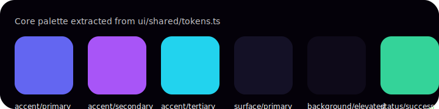

# Design Tokens & Accessibility

The design system centralizes platform-agnostic tokens in `ui/shared/src/tokens.ts`. Each token has a WCAG AA contrast target against the `background/base` color and is consumed by the web, desktop, mobile, and XR renderers through the shared schema.

## Color Tokens
- `accent/primary`, `accent/secondary`, and `accent/tertiary` power gradient-driven CTAs.
- `surface/primary` and `surface/glass` set elevation tiers; glass surfaces must apply a backdrop blur of at least `10px`.
- Status colors (`status/success`, `status/warning`, `status/danger`) require text with `font-weight: 600` and `text/strong` to hit 4.5:1 contrast.

## Typography Tokens
- `display/md` (1.75rem/2rem) is the maximum headline size for mobile to maintain readability.
- `mono/compact` is reserved for workflow IDs and resume tokens streamed from the server.

## Motion & Interaction
- `transition/snappy` governs hover and focus transitions across desktop and web.
- XR spatial transitions should lerp between positions using `duration/slow` to minimize motion sickness.

## Accessibility Requirements
- Every widget must expose an `aria-label` (web/desktop) or `accessibilityLabel` (mobile/XR) derived from the schema `label` field.
- Color contrast ratios must be ≥ 4.5:1; the shared tokens have been audited against `background/base` and `surface/primary` to satisfy this requirement.
- Real-time notifications must remain visible for at least 5 seconds and provide toast stacking for screen-reader re-announcements.
