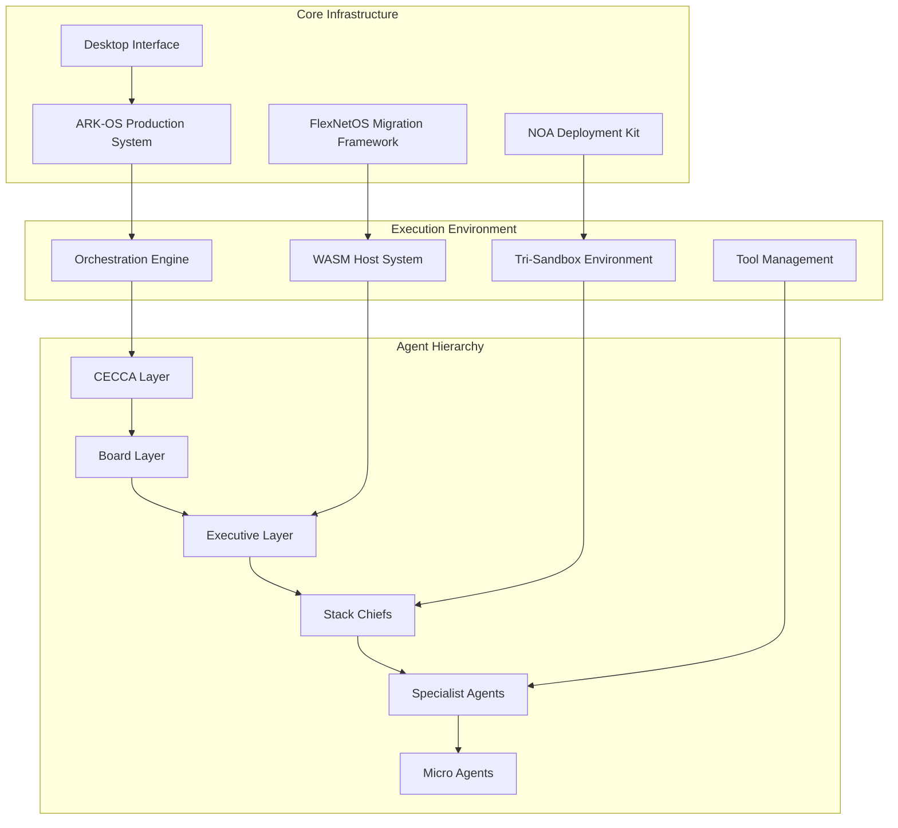
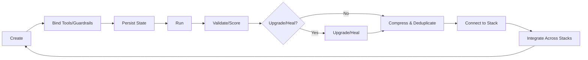
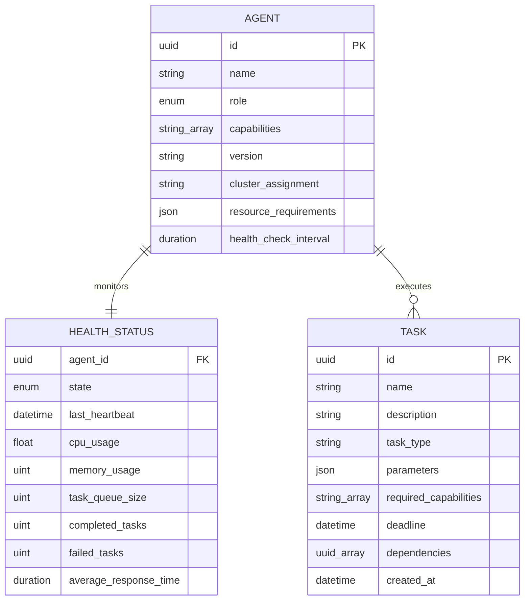

# Multi-Agent AgenticAI Task Deployment Kit

## Overview

The Multi-Agent AgenticAI Task Deployment Kit is a unified, production-ready platform that consolidates multiple agent frameworks, orchestration systems, and deployment tools into a cohesive ecosystem. Built on the "Heal, Don't Harm" principle, this system preserves and enhances all capabilities from multiple repository sources while providing a streamlined deployment experience for autonomous agent workloads.

The system addresses the core challenge of deploying, managing, and orchestrating complex multi-agent systems across diverse environments while maintaining security, reliability, and scalability. It combines enterprise-grade governance with autonomous operation capabilities, providing both human oversight and fully automated execution paths.

## Architecture

### System Overview

### Agent Hierarchy Model

The system implements a six-layer hierarchical agent architecture designed for autonomous operation with strategic oversight:

| Layer | Purpose | Agent Count | Escalation Path |
|-------|---------|-------------|-----------------|
| CECCA | Strategic Command & Control | 1-3 | Human Board |
| Board | Governance & Policy | 5-15 | CECCA |
| Executive | Operational Management | 10-25 | Board |
| Stack Chief | Domain Leadership | 20-50 | Executive |
| Specialist | Expert Capabilities | 50-200 | Stack Chief |
| Micro | Task Execution | 100-1000+ | Specialist |

#### Layer Responsibilities

**CECCA (Command, Executive, Control, Coordination, Authority)**
- Ultimate system authority and strategic direction
- Cross-organizational coordination and conflict resolution
- Emergency system-wide decision making
- Long-term strategic planning and resource allocation

**Board Layer**
- Policy enforcement and governance oversight
- Ethics and compliance monitoring
- Strategic resource allocation approval
- Risk assessment and mitigation planning

**Executive Layer**
- Operational coordination and task orchestration
- Resource management and priority scheduling
- Performance monitoring and optimization
- Emergency response coordination

**Stack Chief Layer**
- Domain-specific leadership and coordination
- Subject matter expertise integration
- Team performance management
- Specialized workflow orchestration

**Specialist Layer**
- Deep domain expertise and complex task execution
- Advanced analysis and decision support
- Integration with external systems and tools
- Specialized workflow implementation

**Micro Layer**
- Atomic task execution and basic operations
- High-volume, parallel processing capabilities
- Simple decision making and rule-based actions
- Resource-efficient operation modes

## Technology Stack & Dependencies

### Core Runtime Environment

| Component | Technology | Purpose |
|-----------|------------|---------|
| Primary Language | Rust 1.70+ | High-performance agent runtime |
| Async Runtime | Tokio | Concurrent task execution |
| Orchestration Scripts | Python 3.8+ | Deployment and management |
| Desktop Interface | Tauri Framework | Cross-platform UI |
| Serialization | Serde, Cap'n Proto | Data exchange and RPC |
| Database | Embedded/Distributed | Agent state persistence |
| Build System | Cargo Workspaces | Modular compilation |

### Agent Framework Dependencies

**Communication & Messaging**
- Inter-agent message passing via channels
- Broadcast systems for layer-wide coordination
- Priority-based message queuing
- Timeout and retry mechanisms

**Resource Management**
- CPU, memory, and storage allocation tracking
- Dynamic resource scaling and constraint handling
- Performance monitoring and optimization
- Resource usage reporting and analytics

**Security & Governance**
- Role-based access control (RBAC) system
- Policy enforcement and compliance monitoring
- Audit trail generation and retention
- Capability token authentication

## Component Architecture

### ARK-OS Production System

The unified production system serves as the primary runtime environment for agent deployment and management.

**Core Services**
- Agent lifecycle management and health monitoring
- Task scheduling and execution coordination
- Resource allocation and constraint management
- Real-time system observability and metrics

**Agent Management**
- Centralized agent registry and discovery
- Health check systems and failure detection
- Dynamic scaling based on workload demands
- Configuration management and updates

**Desktop Interface Integration**
- Real-time monitoring dashboards
- Interactive agent control panels
- Task visualization and flow tracking
- System configuration interfaces

### FlexNetOS Migration Framework

Provides secure, isolated execution environments with comprehensive capability management.

**Three-Plane Architecture**

**Execution Plane**
- Core server and client binaries for agent communication
- WASM host system for secure connector execution
- Multi-binary setup with NUMA optimization support
- Capability token-based authentication system

**Orchestrator Plane**
- Agent runtime with Progress Token (PT) and Proof of Progress (POP) mechanics
- Policy schema validation and enforcement
- Runtime state management and persistence
- Key management and signing operations

**Sandbox Plane**
- Tri-sandbox parallel execution environment (Models A/B/C)
- Evolutionary merge capabilities leading to Model D
- Input/output isolation and validation
- File system integrity and verification

**Tool Integration**
- File system integrity operations with fs-verity support
- Contract testing with Cap'n Proto compilation
- NUMA and hugepages optimization helpers
- Merkle anchoring and SBOM generation
- Signature generation and verification systems

### NOA Deployment Kit

Handles large-scale agent deployment through normalized configuration management.

**Capsule Lifecycle Management**

**Configuration Management**
- CSV-based agent directory with normalization and healing
- JSON schema validation for manifests and capsules
- Automated deployment with dry-run capabilities
- Stack-based organization with hierarchical escalation

**Agent Factories**
- Manifest-driven agent instantiation
- Layer-aware deployment strategies
- Resource requirement validation
- Automatic promotion and demotion policies

## Data Models & Agent Contracts

### Agent Metadata Schema

### Message Protocol Specification

**Agent Communication Messages**

| Message Type | Purpose | Priority Support | Timeout |
|--------------|---------|------------------|---------|
| Request | Direct task assignment | Yes | Configurable |
| Response | Task completion notification | Inherited | N/A |
| Broadcast | Multi-agent coordination | Yes | N/A |
| Alert | System notifications | Critical/Emergency | N/A |
| Heartbeat | Health monitoring | Background | Fixed |
| Registration | Agent lifecycle | System | N/A |

**Task Execution Contracts**

Each agent must implement standardized task execution interfaces:

- Task validation and capability checking
- Resource requirement assessment
- Progress reporting and status updates
- Result serialization and error handling
- Timeout and cancellation support

## Business Logic Layer

### Agent Orchestration Engine

**Autonomous Operation Cycles**
The orchestration engine operates in continuous cycles, managing agent workloads without human intervention while maintaining oversight capabilities.

**Triple Verification System**
- Primary execution with real-time validation
- Secondary verification through parallel execution
- Tertiary audit trail generation and compliance checking

**Auto-Healing Mechanisms**
- Automatic failure detection and recovery
- Agent restart and state restoration
- Load balancing and failover coordination
- System-wide health monitoring and alerting

**Resource Management**
- Dynamic allocation based on agent requirements
- Constraint-based scheduling and optimization
- Performance monitoring and scaling decisions
- Cost tracking and budget management

### Task Distribution Strategy

**Priority-Based Scheduling**

| Priority Level | Response Time | Resource Allocation | Escalation |
|----------------|---------------|-------------------|------------|
| Emergency | Immediate | Unlimited | Automatic |
| Critical | < 5 seconds | High | Conditional |
| High | < 30 seconds | Medium | Queue-based |
| Medium | < 5 minutes | Standard | Timer-based |
| Normal | < 30 minutes | Limited | Policy-driven |
| Low | < 4 hours | Minimal | Background |
| Maintenance | Best Effort | Surplus | Manual |

**Load Balancing Algorithms**
- Capability-based agent selection
- Resource availability assessment
- Historical performance consideration
- Geographic and network proximity optimization

### Policy Enforcement Architecture

**Governance Integration**
- Board-level policy definition and approval
- Automated policy enforcement at execution layers
- Compliance monitoring and audit trail generation
- Exception handling and escalation procedures

**Security Framework**
- Role-based access control across all layers
- Capability token validation for sensitive operations
- Encrypted communication between agents
- Audit logging and forensic capabilities

## Middleware & Interceptors

### Communication Middleware

**Message Processing Pipeline**
- Authentication and authorization validation
- Message routing and delivery optimization
- Priority queue management and throttling
- Error handling and retry mechanisms

**Protocol Handlers**
- JSON-based message serialization
- Cap'n Proto for high-performance RPC
- WebSocket connections for real-time updates
- HTTP REST APIs for external integration

### Security Interceptors

**Access Control**
- Token-based authentication for all operations
- Role validation against requested capabilities
- Resource access permission verification
- Audit trail generation for all access attempts

**Data Protection**
- Encryption of sensitive data in transit and at rest
- Secure key management and rotation
- Data classification and handling policies
- Privacy protection and anonymization

### Monitoring & Observability

**Metrics Collection**
- Real-time performance monitoring across all agents
- Resource usage tracking and optimization insights
- Task completion rates and error analytics
- System health indicators and alerting

**Distributed Tracing**
- End-to-end task execution tracking
- Inter-agent communication visualization
- Performance bottleneck identification
- Root cause analysis capabilities

## Testing Strategy

### Unit Testing Framework

**Agent Testing**
- Individual agent functionality validation
- Mock dependencies and isolated testing
- Capability verification and edge case handling
- Performance benchmarking and resource usage validation

**Integration Testing**
- Inter-agent communication testing
- End-to-end workflow validation
- System behavior under load conditions
- Failure scenario testing and recovery validation

### System Testing Approach

**Deployment Validation**
- Dry-run deployment testing with full validation
- Configuration schema verification
- Resource requirement validation
- Security policy enforcement testing

**Performance Testing**
- Load testing with multiple agent configurations
- Scalability testing across different deployment sizes
- Resource optimization and constraint handling
- Real-world scenario simulation and validation

**Security Testing**
- Penetration testing of agent communication channels
- Access control and privilege escalation testing
- Data protection and encryption validation
- Compliance and audit trail verification

### Continuous Testing Integration

**Automated Test Suites**
- Unit test execution on every code change
- Integration testing for major component updates
- Security scanning and vulnerability assessment
- Performance regression testing and monitoring

**Quality Gates**
- Code coverage requirements and validation
- Security policy compliance verification
- Performance benchmark achievement
- Documentation completeness and accuracy